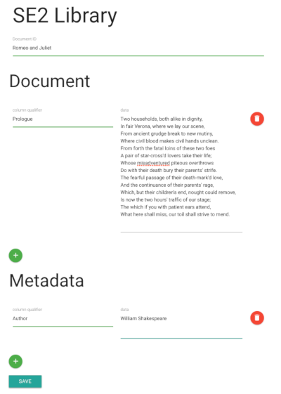
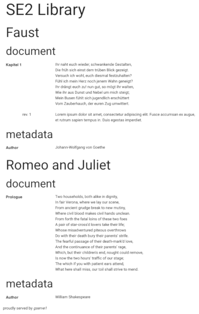

.. |architecture| image:: ./image/architecture.png
   :alt: General Architecture

Systems Engineering 2 - Assignment 1
====================================

Task description
----------------

Users of an online **document library** are presented with an input form, where they can submit *documents*
(e.g., books, poems, recipes) along with *metadata* (e.g., author, mime type, ISBN).
For the sake of simplicity, they can view *all* stored documents on a single page.

+------------+---------------+
| Input form | Output sample |
+------------+---------------+
| |form|     | |output|      |
+------------+---------------+

You are required to develop the online **document library** consisting of multiple services that are partially already existing.
For some services you will have to write Dockerfiles while for other services you will have to write code.
The complete project is setup using individual Dockerfile and Docker-Compose to start the services.
Hence, you are to create an application with the following architecture.

+----------------+
| |architecture| |
+----------------+

Aspects that you need to learn to succeed
-----------------------------------------

* How to use Git
* What is Docker, how does it work
* How to write Dockerfiles
* What is Docker-Compose and how does it work
* How to write Docker-Compose files
* How to setup networks in Docker
* How to mount volumes in Dockerfile
* Programming in Go
* Fundamental knowledge of Hbase, ZooKeeper, and REST

Links
-----

* `Docker Docs <https://docs.docker.com/>`_
* `Docker Compose getting started <https://docs.docker.com/compose/gettingstarted/>`_
* `Docker Compose file reference <https://docs.docker.com/compose/compose-file/>`_
* `Apache HBase Reference Guide <http://hbase.apache.org/book.html>`_
* `ZooKeeper Documentation <http://zookeeper.apache.org/doc/trunk/>`_
* `Go Documentation <https://golang.org/doc/>`_
* `Pro Git <https://git-scm.com/book/en/v2>`_

Components
----------

In the following, the text provides an overview of the different components and the respective tasks that you have to fulfill.

Nginx
~~~~~

Nginx is a web server that delivers static content in our architecture.
Static content comprises the landing page (index.html), JavaScript, css and font files located in ``nginx/www``.

1. Edit and complete the ``nginx/Dockerfile``

   a) Upgrade the system
   #) Install nginx
   #) Copy ``nginx/nginx.conf`` from host to container's ``/etc/nginx/nginx.conf``
   #) Use port 80 in the container
   #) Run nginx on container startup

#. Edit the central docker-compose file

   a) Build the image using the Dockerfile for nginx
   #) Assign nginx to the ``se_backend`` network
   #) Mount the host directory ``nginx/www`` to ``/var/www/nginx`` in the container

#. Verify your setup (it should display the landing page)

HBase
~~~~~

We use HBase, the open source implementation of Bigtable, as database.
``hbase/hbase_init.txt`` creates the ``se2`` namespace and a ``library`` table with two column families: ``document`` and ``metadata``.

1. Build the docker image for the Dockerfile located in ``hbase/``
#. Edit the docker-compose file
   
   * Add hbase to the ``se_backend`` network

#. Start the hbase container to test it and to familiarize yourself with HBase:

   * The Container exposes different ports for different APIs.
   * We recommend to use the JSON REST API, but choose whatever API suits you best.
   * `HBase REST documentation <http://hbase.apache.org/book.html#_rest>`_
   * The client port for REST is 8080
   * Use Curl to explore the API
      * ``curl -vi -X PUT -H "Content-Type: application/json" -d '<json row description>' "localhost:8080/se2:library/fakerow"``
      * yes, it's really *fakerow*
   
ZooKeeper
~~~~~~~~~

Deviating from the architecture image, you don't need to create an extra ZooKeeper container.
**The HBase image above already contains a ZooKeeper instance.**

1. Add an alias to the hbase section in the docker-compose file such that other containers can connect to it by referring to the name ``zookeeper``

Grproxy
~~~~~~~

This is the first service/server you have to write by yourself.
Implement a reverse proxy that forwards every request to nginx, except those with a "library" prefix in the path (e.g., ``http://host/library``).
Discover running gserve instances with the help of teh ZooKeeper service and forward ``library`` requests in circular order among those instances (Round Robin).

1. Implement the reverse proxy in *grproxy/src/grproxy/grproxy.go*
#. Edit and complete ``grproxy/Dockerfile``
#. In the docker-compose file:

   a) Build the grproxy container image
   #) Add grproxy to both networks: ``se_frontend`` and ``se_backend``

Gserve
~~~~~~

Gserve is the second service you need to implement, and it serves two purposes.
Firstly, it receives ``POST`` requests from the client (via grproxy) and adds or alters rows in HBase.
And secondly, it replies to ``GET`` requests with an HTML page displaying the contents of the whole document library.
It only receives requests from grproxy after it subscribed to ZooKeeper, and automatically unsubscribes from ZooKeeper if it shuts down or crashes.

1. Gserve shall return all versions of HBase cells (see output sample above)
#. The returned HTML page **has to** contain the string *"proudly served by gserve1"* (or gserve2, ...) without HTML tags in between
#. Edit and complete ``gserve/Dockerfile``
#. In the docker-compose file

   a) Build the gserve container
   #) Start two instances *gserve1* and *gserve2*
   #) Add both instances to the ``se_backend`` network
   #) Make sure, that both instances start after hbase and grproxy
   #) Provide the names of the instances (gserve1, gserve2) via environment variables
